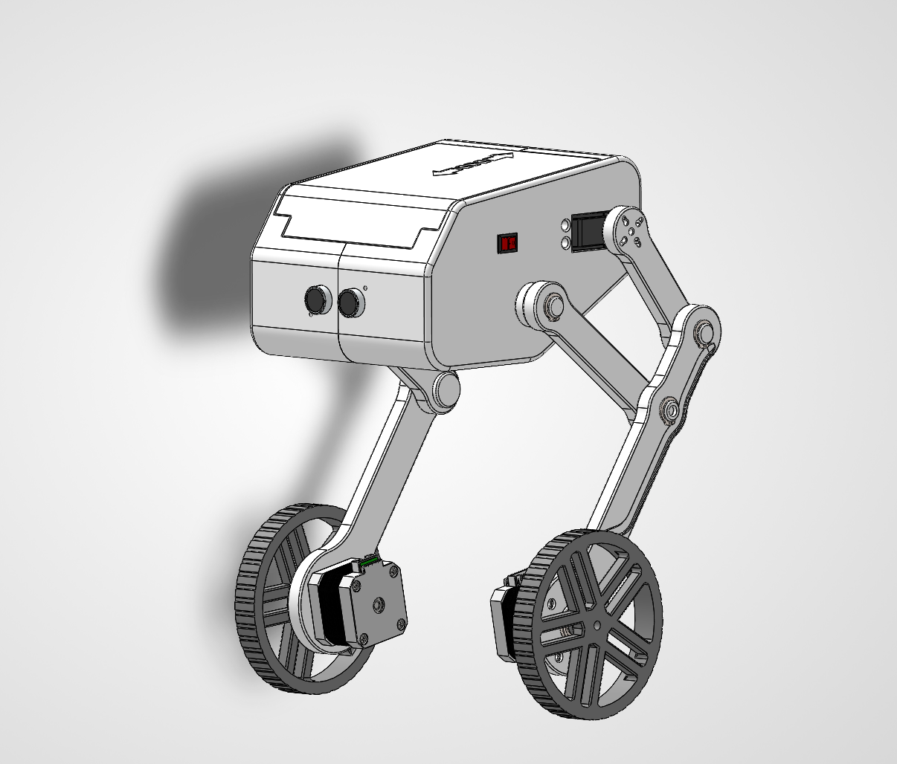
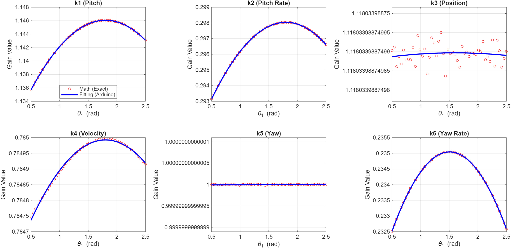

# Two-Wheeled Self-Balancing Wheel-Legged Robot
**Department of Mechatronics Engineering - Control Systems I**

---

## 📖 Project Overview
This project involves the development of a hybrid locomotion system that combines the high maneuverability of wheeled rovers with the terrain adaptability of bipedal kinematics. By integrating two legs with wheeled feet, the robot can perform height adjustments, X-Y planar navigation, and obstacle avoidance while maintaining vertical equilibrium. The dynamic modeling is based heavily on a four-link geometric-dynamic coupling approach, effectively merging a dual-wheel inverted pendulum with a variable-height linkage mechanism.

*Figure 1: The fully assembled Two-Wheeled Self-Balancing Wheel-Legged Robot.*

---

## ⚙️ System Architecture
The project is divided into four main engineering pillars:

* **Mechanical Design:** A 2-DOF per leg assembly designed in SolidWorks, optimized for a low Center of Mass (CoM) and minimal inertia. Actuation is handled by NEMA 17 Stepper motors for wheel drive/X-Y motion and Servo motors for leg articulation.
* **Mathematical Modeling:** Derivation of the system's equations of motion, resulting in a non-linear state-space model that decouples the dual-wheel inverted pendulum from the four-link kinematics.
* **Control Engineering:** Implementation of a nested loop control architecture:
    * **Inner Loop:** Proportional-Derivative (PD) control for leg height adjustment and Virtual Model Control (VMC) for joint torque mapping.
    * **Outer Loop:** Linear Quadratic Regulator (LQR) for optimal tilt stabilization and spatial trajectory tracking.
* **Embedded Systems:** Built around an Arduino Nano/ESP32 architecture, featuring real-time sensor fusion using an MPU6050 IMU for attitude estimation. 

---

## 🧠 Control Strategy & Mathematical Modeling
Due to the nonlinear and strongly coupled characteristics of wheeled bipedal robots, developing an accurate mathematical model is critical. 

### State-Space Representation
To design the LQR controller, the system was linearized around the upright equilibrium point ($\theta \approx 0$). 

**4-State Baseline Model (Longitudinal Motion):**
Handles forward/backward displacement and pitch stabilization.

$$X_4 = [x, \dot{x}, \theta, \dot{\theta}]^T$$

**6-State Advanced Model (Spatial Motion):**
Integrates differential drive kinematics to actively command asymmetric torque for yaw (steering) without destabilizing the pitch axis.

$$X_6 = [x, \dot{x}, \theta, \dot{\theta}, \delta, \dot{\delta}]^T$$

**Objective:**
Minimize the cost function $J$ to find the optimal gain matrix $K$, balancing the penalty on pitch deviation against excessive torque demands:
$$J = \int_{0}^{\infty} (X^T Q X + u^T R u) dt$$

### Polynomial Fitting & Real-Time Gain Scheduling
A fundamental challenge of this robot is that its center of mass ($l_w$) and rotational inertia continuously change as the leg linkages flex and extend. Continuously solving the discrete Algebraic Riccati Equation (DARE) for the LQR controller is computationally expensive and would cause severe loop latency on an embedded microcontroller.

To solve this, an offline **Polynomial Gain Scheduling** architecture was developed:
1.  **Offline MATLAB Evaluation:** The optimal feedback gain matrices ($K$) were pre-calculated across the entire operational range of the upper servo angle ($\theta_1$).
2.  **Curve Fitting:** A least-squares fitting algorithm modeled the relationship between $\theta_1$ and each gain value into second-order polynomials:
    $$k_i(\theta_1) = a_i\theta_1^2 + b_i\theta_1 + c_i$$
3.  **Real-Time Execution:** During live operation, the microcontroller simply reads the current servo angle and evaluates these polynomials to instantly update the $K$ matrix coefficients. This reduces complex matrix calculus to basic arithmetic, enabling an ultra-fast control frequency of 200 Hz.

*Figure 2: MATLAB polynomial curve fitting vs. exact mathematical $K$ matrix gains across the operational servo angles.*

---

## 📁 Repository Navigation
* **/hardware:** SolidWorks `.SLDASM` files, 3D printing STL files.
* **/simulation:** `.slx` Simulink models (including Simscape Multibody environments) and MATLAB kinematics/fitting scripts.
* **/firmware:** Source code for the microcontroller (written in C++), featuring I2C MPU6050 drivers, offline polynomial arrays, and the high-frequency LQR/PD control loops.
* **/docs:** Reference papers, the final project report, and the mathematical derivation of the plant.
* **/media:** Videos and pictures of the physical testing.

---

## 🎯 Key Technical Features
* **Dynamic Balancing:** Active rejection of external gravity and impulse forces via continuous LQR state-feedback.
* **Variable Height & Gain Scheduling:** Offline polynomial curve fitting ensures the LQR controller dynamically adapts to shifting inertia and CoM as the robot squats or stands.
* **Virtual Model Control (VMC):** Bridges multi-body mechanics to actuator joint spaces, calculating required support forces without injecting disruptive disturbances into the primary balancing loop.
* **Sim-to-Real Verification:** Validated 3D multi-body pitch stabilization inside a high-fidelity Simscape physical environment prior to hardware deployment.

---

## 👥 Team Members
* **Doaa Essam, Amr Mohamed, Alyaa Mohamed, Abdelrahman Hatem, Esraa Mohamed, Mina Sameh**

### Under supervision of: 
* **Assoc. Prof. Dr. Shuaiby Mohamed**
* **Faculty of Engineering, Assiut University (2025-2026)**